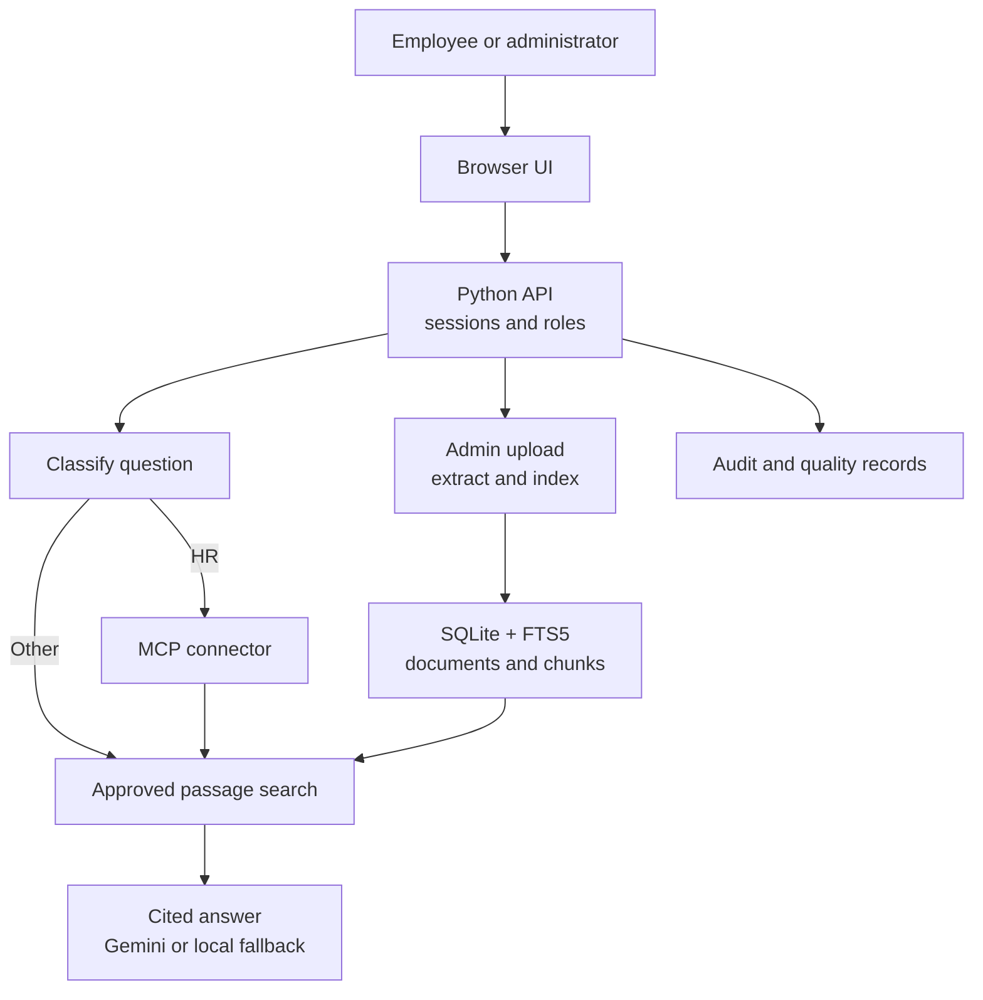
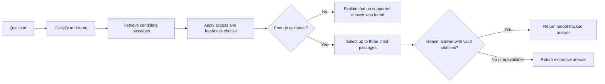

# Infosys AI Knowledge Assistant (Enterprise GPT)

A capstone prototype for governed document question answering. Employees ask natural-language questions and receive answers with source citations. Administrators can upload approved documents, inspect connector activity, and review quality signals. The interface uses Infosys-inspired styling for the demonstration and is not an official Infosys product.

**Live demo:** [infosys-enterprise-gpt-demo.onrender.com](https://infosys-enterprise-gpt-demo.onrender.com/) (Render Free). Select a demo account and request the shared password from the project owner.

> **Demo data:** The included documents are fictional examples created for this project. They are not Infosys policies or internal records.


## Product preview

| Cited answer | Source preview |
| :---: | :---: |
|  |  |

| Document ingestion | Quality analytics |
| :---: | :---: |
|  |  |

The [employee access screenshot](assets/screenshots/10_employee_access_boundary.png) shows how a Delivery account is kept outside HR-only material.

## How the parts connect



The MCP tool is a bundled local connector. Gemini receives only retrieved passages that passed the access filter. The local hashed vectors are lexical features, not semantic embeddings. See the [architecture notes](docs/architecture.md).

### Question-to-answer pipeline



## Run locally

Requires Python 3.11 or newer. No frontend build step is needed.

```powershell
cd G:\AlmaBetter\infosys-ai-knowledge-assistant-enterprise-gpt
python -m venv .venv
.\.venv\Scripts\python.exe -m pip install -r requirements.txt
.\.venv\Scripts\python.exe app.py
```

Open **http://127.0.0.1:8000**. On later runs, only the `cd` and final `app.py` commands are needed. The login screen offers administrator and employee accounts for Delivery, HR, Engineering, and Sales. Set `DEMO_PASSWORD` in `.env` or the host's environment to control the shared demo password; the login page does not display it.

For macOS/Linux, activate the virtual environment and run `python app.py` with the same environment variables. `pypdf` is only required for PDF uploads; TXT, Markdown, and DOCX work with the standard library.

## Demo in five minutes

1. Sign in as **Administrator**. Ask “What is the annual leave request process?” The answer uses the **MCP curated knowledge** route and shows a citation.
2. Open its source card to inspect the approved passage and metadata.
3. Open **Knowledge library** to inspect the five seeded collections and upload a new TXT, MD, DOCX, or PDF file with department, classification, owner, and dates.
4. Open **Quality analytics** to see the query, route, no-answer rate, citation coverage, and connector event.
5. Sign out and use **Delivery employee**. Ask the same HR question. The assistant must decline because HR material is outside that account's access scope.

See [docs/demo_script.md](docs/demo_script.md) for a recording script and narration.

## What works

- Upload validation, duplicate detection, DOCX/PDF/TXT/MD extraction, section-aware chunking, source metadata, and SQLite indexing.
- Permission-aware search with local lexical vectors and term overlap, filtering expired or archived documents.
- Query classification and a real read-only MCP stdio JSON-RPC tool route for HR queries, with connector events and a local fallback on connector failure.
- Source-grounded answers with numbered citations; optional Gemini synthesis when `GEMINI_API_KEY` is configured. Without a key, the app uses transparent extractive synthesis.
- No-answer behavior, source preview, feedback capture, role-based screens, audit events, and quality analytics.
- Five fictional sample documents covering delivery, HR, engineering, sales, and project onboarding.

## Technology by component

| Part | Technology | Purpose |
| --- | --- | --- |
| Frontend | HTML, CSS, JavaScript in `static/` | Login, questions, citations, library, analytics. |
| Backend | Python standard-library HTTP server in `app.py` | Sessions, API routes, query workflow, access checks. |
| Knowledge layer | `knowledge.py` and SQLite FTS5 | Intake, metadata, lexical retrieval, citations, quality records. |
| Connector | `mcp_server.py` over stdio JSON-RPC | Read-only curated-knowledge route for HR questions. |
| Optional LLM | Gemini API | Synthesize an answer from approved retrieved passages. |
| PDF intake | `pypdf` | Extract text from uploaded PDFs. |

## API at a glance

The browser calls JSON endpoints in `app.py`. Login sets an `HttpOnly` session cookie; protected routes use that cookie and apply the signed-in user's role and department.

| Method | Endpoint | Purpose |
| --- | --- | --- |
| `POST` | `/api/login` | Sign in and start a session. |
| `GET` | `/api/me` | Return the current user. |
| `POST` | `/api/query` | Ask a question and receive an answer with citations. |
| `GET` | `/api/documents` and `/api/documents/{id}` | List permitted documents and preview a source. |
| `POST` | `/api/documents/upload` | Validate and index a document (administrator only). |
| `GET` | `/api/connectors` | Show the configured MCP connector. |
| `GET` | `/api/analytics` | Return usage and quality metrics (administrator only). |

The [full API reference](docs/api_documentation.md) includes the remaining endpoints, access rules, request and response fields, and error codes.

## Configuration

Copy `.env.example` to `.env` and set values before a shared deployment. `.env` is ignored by Git.

| Variable | Purpose |
| --- | --- |
| `APP_SECRET` | HMAC signing key for 12-hour session cookies. Required for a public bind. |
| `DEMO_PASSWORD` | Password for seeded demo accounts. Required for a public bind. |
| `GEMINI_API_KEY` | Optional model-backed synthesis; never sent to the browser. |
| `GEMINI_MODEL` | Gemini model name, default `gemini-flash-latest`. |
| `APP_DB` | SQLite database path, default `data/app.db`. |
| `HOST`, `PORT` | Listening address and port; default `127.0.0.1:8000`. |

The model request sends only passages that passed the permission filter. Avoid putting sensitive real company documents into a demo deployment without an approved identity provider, data retention policy, and security review.

The live Render Free service uses this public GitHub repository, Python 3.12, a Singapore instance, and the build/start commands in the [deployment guide](docs/deployment.md). The dashboard stores `APP_SECRET`, `DEMO_PASSWORD`, and `GEMINI_API_KEY` as environment variables; the local `.env` file is not transferred. Render Free uses an ephemeral filesystem: sample documents reseed after a restart, but uploads, feedback, and analytics history do not persist. The included [`render.yaml`](render.yaml) is a template for future Blueprint deployments.

## Project layout

```text
app.py                 HTTP API, login, routing, answer workflow
knowledge.py           ingestion, indexing, permission checks, retrieval, analytics
mcp_server.py          read-only MCP stdio connector
static/                employee and administrator web interface
data/sample_*/         fictional seed documents
tests/                 workflow and access-control tests
docs/                  architecture, APIs, demo, evaluation, deployment notes
```

## Test

```powershell
.\.venv\Scripts\python.exe -m unittest discover -s tests -v
```

The tests use a temporary database and verify the MCP answer route, citations, restricted-source behavior, no-answer handling, seeded content, duplicate detection, and analytics.

## Submission status

The repository and public review demo are ready. A recording and actual team-member names still need to be added for final submission. The application is a **capstone prototype**. The full enterprise blueprint would additionally require evaluated semantic embeddings and a vector store, managed connectors, enterprise identity, document refresh and approval workflows, and deeper answer-quality monitoring. These limitations are detailed in [security notes](docs/security_notes.md) and [deployment notes](docs/deployment.md). The brief's suggested stacks are options rather than mandatory choices; this implementation uses Python's standard library and a small optional PDF package to remain easy to run.

## Team contribution

Implementation, sample data, documentation, and automated tests were prepared in this workspace. Add the actual contributor names and responsibilities before final submission.
